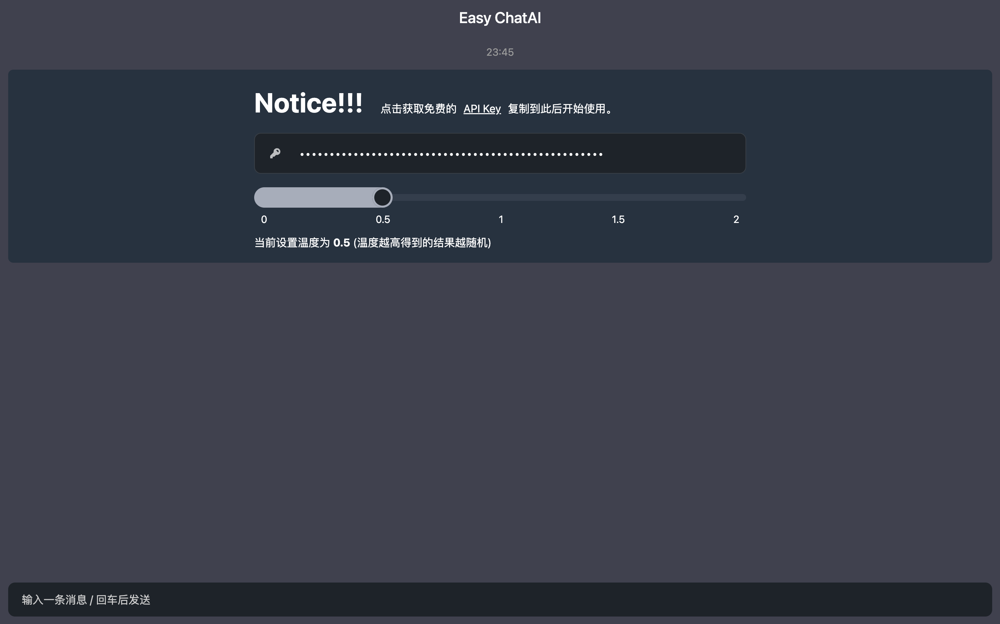

<div align="center">
    <h1>Easy ChatAI</h1>
	<h3>简易聊天机器人</h3>
</div>

## 一、简介

#### 	基于 [ChatUI](https://github.com/alibaba/ChatUI)、[GPT_API_free](https://github.com/chatanywhere/GPT_API_free) 、Vite-React-TS 进行开发的简易聊天机器人。

#### 	支持 Docker 一键部署启动，打开网页即可使用（需要GitHub账号获取免费API后方可使用）



## **二、安装说明**

```apl
npm i 
npm run dev
```

#### （推荐）

```apl
cnpm i 
npm run dev
```


### **联系**

#### **WeChat:  Y__OOO_O**
